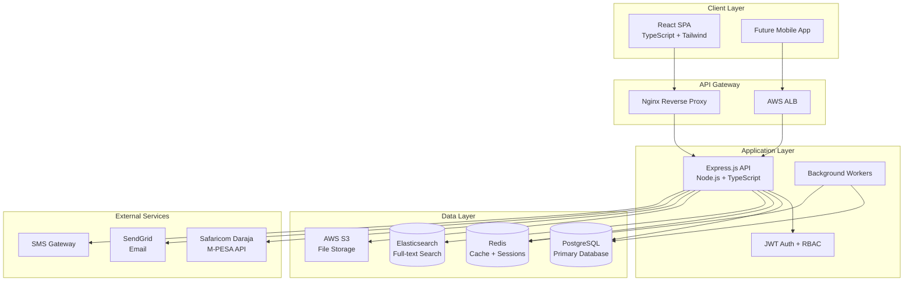

# Jolu Group ERP — System Architecture

## Overview

Jolu ERP is a modular, multi-tenant enterprise system designed for three independent companies operating under the Jolu Group umbrella. The architecture follows a classic three-tier pattern optimized for cloud deployment on AWS.

## Architecture Diagram



## Multi-Company Model

```
Jolu Group (Organization)
├── Jolu Machineries Ltd (MACHINERIES)
│   ├── Head Office
│   ├── Nairobi Branch
│   └── Nakuru Branch
├── Jolu Group Security Ltd (SECURITY)
│   ├── Head Office
│   ├── Nairobi Branch
│   └── Nakuru Branch
└── Jolu Automobile Ltd (AUTOMOBILE)
    ├── Head Office
    ├── Nairobi Branch
    └── Nakuru Branch
```

Each company maintains **isolated data** (customers, inventory, invoices, accounting) while group administrators access consolidated dashboards via cross-company queries.

### Company Context

Every API request includes `X-Company-Id` header. The auth middleware validates user access to the requested company before processing.

## Module Architecture

| Module | Description | Key Entities |
|--------|-------------|--------------|
| Core | Auth, RBAC, audit, notifications | User, Role, Permission, AuditLog |
| CRM | Lead pipeline, customers, activities | Customer, Lead, Activity, Reminder |
| Inventory | Machinery, spare parts, vehicles | MachineryUnit, SparePart, Vehicle |
| Financing | Bank loan workflow | BankFinancingApplication |
| After Sales | Service tickets | ServiceTicket, ServiceTicketPart |
| Security | Guards, contracts, deployments | SecurityClient, Guard, Site |
| Accounting | Double-entry bookkeeping | ChartOfAccount, JournalEntry |
| Invoicing | All document types + PDF | Invoice, InvoiceLine, InvoicePayment |
| Payments | M-PESA integration | MpesaTransaction |
| Petty Cash | Branch cash management | PettyCashAccount, PettyCashRequest |

## Security Architecture

### Authentication Flow

1. User submits credentials → bcrypt password verification
2. Optional 2FA via TOTP (otplib)
3. JWT access token (15min) + refresh token (7 days) issued
4. Session stored in PostgreSQL with IP, user agent, device info

### Authorization (RBAC)

```
Request → JWT Validation → Session Check → Role Permission Check → Company Access Check → Handler
```

11 predefined roles with module-level permissions. Super Admin and Group Admin bypass permission checks.

### Audit Trail

Every mutating API request logs: user, company, action, module, IP address, user agent, request body.

## Scalability Design

- **Horizontal scaling**: Stateless API servers behind ALB
- **Database**: PostgreSQL with read replicas for reporting
- **Caching**: Redis for session data, dashboard KPIs, permission lookups
- **Search**: Elasticsearch for customer/lead/inventory full-text search
- **File storage**: AWS S3 for documents, PDFs, imports/exports
- **Background jobs**: Import/export processing, notification dispatch

## Deployment Topology (AWS)

```
Route 53 → CloudFront (CDN) → ALB → ECS Fargate (API + Frontend)
                                      ├── RDS PostgreSQL (Multi-AZ)
                                      ├── ElastiCache Redis
                                      ├── OpenSearch (Elasticsearch)
                                      └── S3 Bucket
```

## Technology Decisions

| Decision | Rationale |
|----------|-----------|
| PostgreSQL over MongoDB | ACID compliance for accounting, relational data model |
| Prisma ORM | Type-safe queries, migration management |
| JWT over sessions | Stateless API, mobile-ready |
| Monorepo | Shared types, unified CI/CD |
| Docker | Consistent dev/prod environments |
