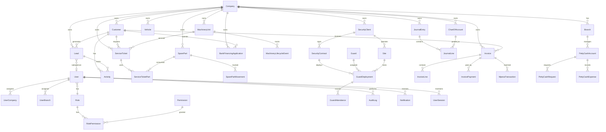

# Database Schema & ER Diagram

## Entity Relationship Diagram

## Core Tables

### Multi-Company

| Table | Purpose | Key Fields |
|-------|---------|------------|
| `Company` | Business entity | code, name, kraPin, currency |
| `Branch` | Physical location | code (HEAD_OFFICE, NAIROBI, NAKURU) |

### Authentication & RBAC

| Table | Purpose |
|-------|---------|
| `User` | System users with 2FA support |
| `Role` | 11 predefined roles |
| `Permission` | Module.action pairs |
| `RolePermission` | Role-permission mapping |
| `UserCompany` | User-company assignments |
| `UserBranch` | User-branch assignments |
| `UserSession` | Active sessions with device tracking |
| `AuditLog` | Complete activity audit trail |

### CRM Pipeline Stages

**Lead Stages (Detailed):**
LEAD → FIRST_CONTACT → NEEDS_ASSESSMENT → QUOTATION_SENT → APPLICATION_SUBMITTED → BANK_REVIEW → BANK_APPROVED/BANK_REJECTED → CUSTOMER_DEPOSIT_RECEIVED → UNIT_ALLOCATED → DOCUMENTATION_COMPLETE → REGISTRATION_COMPLETE → DELIVERED → AFTER_SALES_ACTIVE

**Pipeline Stages (Kanban):**
NEW_LEAD → QUALIFIED → PROPOSAL_SENT → APPLICATION_SUBMITTED → BANK_APPROVAL → WON/LOST

### Inventory

| Table | Key Fields |
|-------|------------|
| `MachineryUnit` | chassisNumber, engineNumber, serialNumber, stockStatus |
| `MachineryLifecycleEvent` | eventType, performedBy, metadata |
| `SparePart` | partNumber, barcode, reorderLevel |
| `SparePartMovement` | STOCK_IN, STOCK_OUT, SERVICE_DEDUCTION |
| `Vehicle` | registrationNumber, mileage, year |

**Stock Status Enum:** IN_STOCK, RESERVED, SOLD, DELIVERED

### Accounting (Double-Entry)

Default Chart of Accounts:
- 1000 Cash (Asset)
- 1100 Accounts Receivable (Asset)
- 1200 Inventory (Asset)
- 1300 Bank Account (Asset)
- 1400 M-Pesa Account (Asset)
- 2000 Accounts Payable (Liability)
- 2100 VAT Payable (Liability)
- 3000 Owner Equity (Equity)
- 4000/4100 Revenue accounts
- 5000/5100/5200 Expense accounts

Journal entries must balance: total debits = total credits.

### Invoice Types

PROFORMA, TAX_INVOICE, RECEIPT, CREDIT_NOTE, DEBIT_NOTE, PURCHASE_ORDER, DELIVERY_NOTE, QUOTATION

Numbering format: `{PREFIX}-{YEAR}-{SEQUENCE}` (e.g., INV-2026-000001)

## Indexes

Performance-critical indexes:
- `Customer(companyId, phone)` — customer lookup
- `Lead(companyId, stage)` — pipeline queries
- `MachineryUnit(companyId, stockStatus)` — inventory filtering
- `Invoice(companyId, status)` — receivables
- `AuditLog(userId, createdAt)` — audit queries
- `AuditLog(companyId, createdAt)` — company audit

## Data Isolation

All business tables include `companyId` foreign key. API middleware enforces company context on every request. Group-level queries aggregate across authorized companies only.
