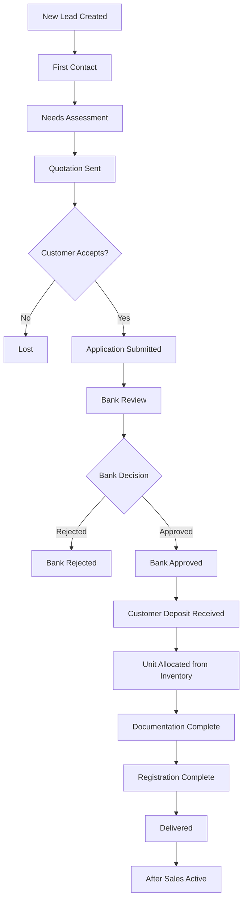
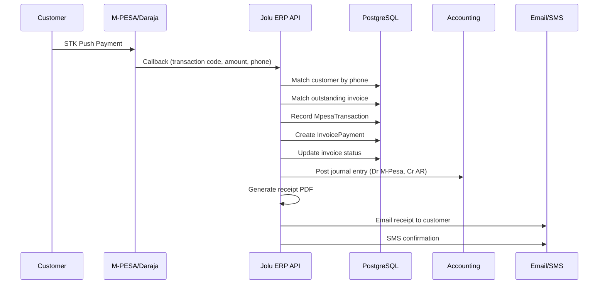
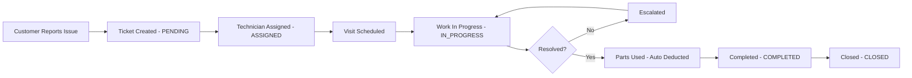
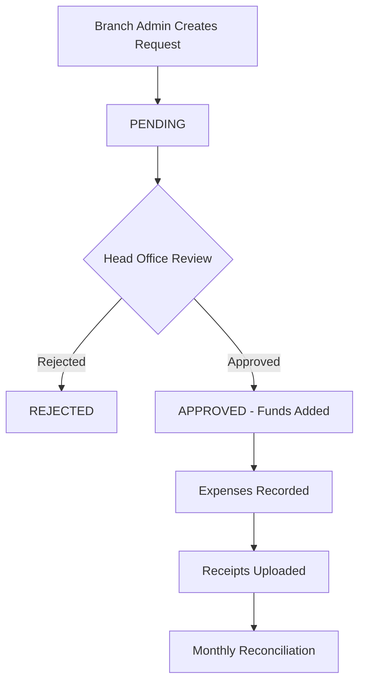
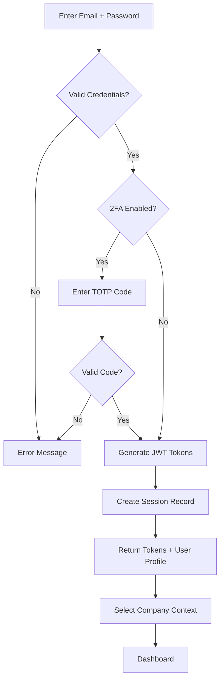
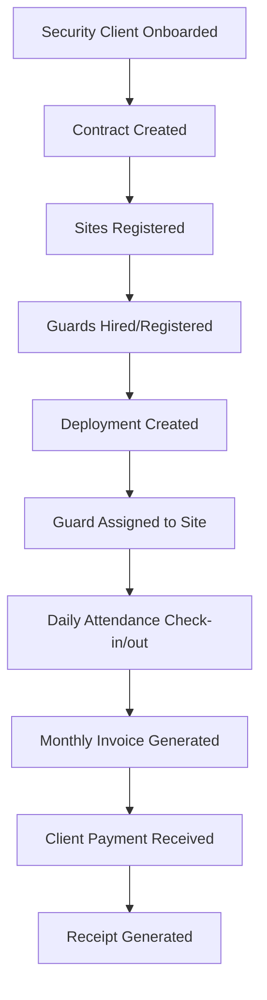
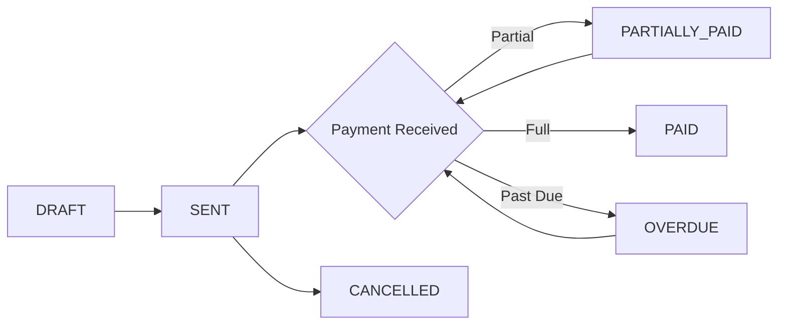
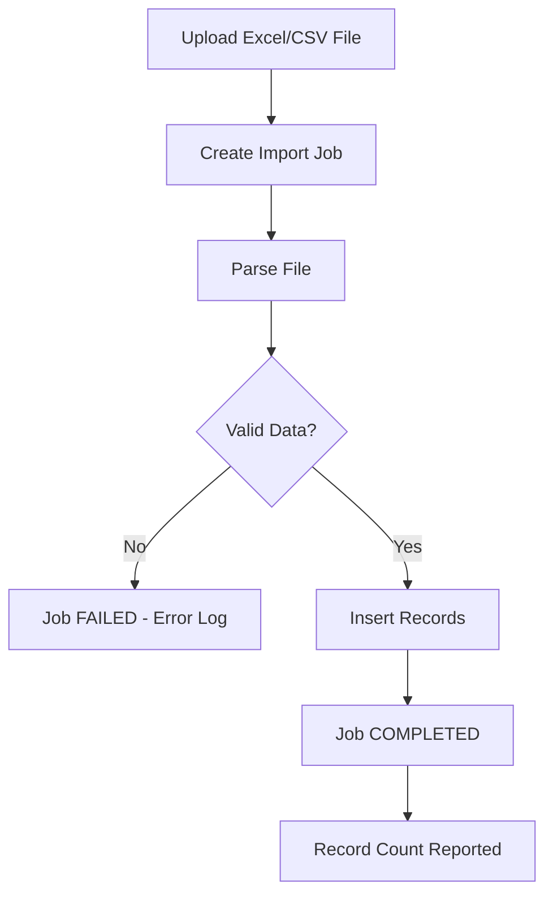

# User Flows

## 1. Sales Lead to Delivery Flow

## 2. M-PESA Payment Flow

## 3. Service Ticket Flow

## 4. Petty Cash Request Flow

## 5. User Authentication Flow

## 6. Security Guard Deployment Flow

## 7. Invoice Lifecycle

## 8. Import Data Flow

